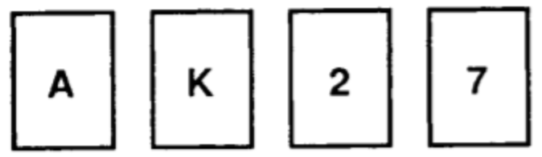
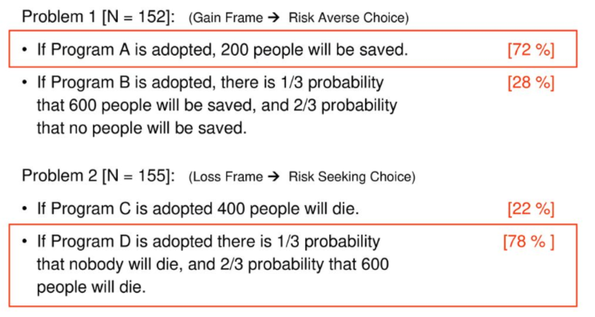
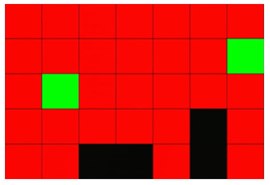
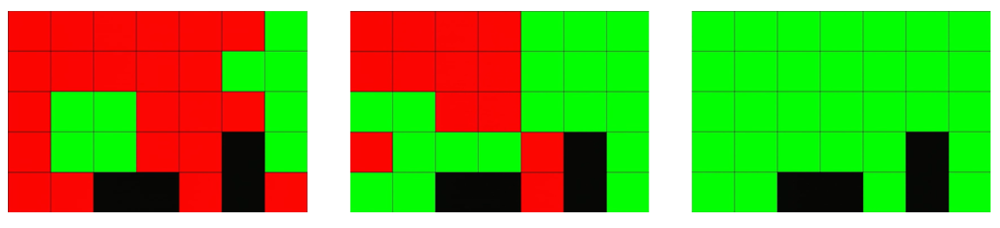

A random collection of essays I have written over the years, either for courses or for fun.

-------------------------------------------------------------------------------------------
### Reasoning 
According to long withstanding philosophical ideas, reasoning is what enables the human mind to go beyond mere perception, habit, and instinct, making humans unique. Kahneman proposed a system of that thinking that is made up of two different subsystems. System 1 (Intuition) was said to be the fast process whereas System 2 (Reasoning) was said to be the slower and deliberative process. Reasoning is generally seen as a means to improve upon the decisions made in the first, faster system. But, it hasn’t always been the case that this deliberative process of reasoning always leads to a better decision. Therefore, a question arises. Why do we actually reason? And how do we reason? 

There are several preliminary questions to be considered before we try to answer these two questions. One of them is the question of logical truth. Is logical truth the objective truth or is it influenced by cultural influences and is actually subjective? Are we all reasoning towards the same logical, objective truth or is there a discrepancy amongst us about what the final reachable truth is. If there is no objective logical truth, then the question is how did an almost identical concept of formal logic arise parallelly and independently across cultures? 

How do we reason? 

There are several ideas that try to answer this question about how reasoning happens in the human mind. Three major systems of reasoning that are followed have been devised:
1. Normative Reasoning - following formal logic  
   Modus tollens: ¬q, p → q / ¬p,   
   Bayes’ theorem: P(D|S) = P(S|D)/P(D) 
2. Descriptive Reasoning -  reasoning as it is done  
   ¬q, p → q / nothing can be derived  
   P(D|S)= P(S|D), neglect the “base rate” 
3. Prescriptive rules - taking bounded rationality into account  
   classically invalid principle ¬q, p ∧ r → q/¬p ∧ ¬r is correct according to closed–world reasoning

There are different views with respect to whether human reason according to one or more of these systems and whether there is a scope of improvement or changing from one system to another. The three major views are Panglossian, Meliorist and Apologist. Eliminativism is an extreme view that posits that none of these systems are followed. A Panglossian view states that humans actually reason normatively and whatever shortcomings we have can be attributed to a discrepancy in interpretation. An Apologist and Meriolist view suggest that human reasoning is actually prescriptive in nature (the main difference between the two being that the Apologist view believes that no learning can help improve this subnormal reasoning whereas the Meriolist view believes that learning can lead to improved reasoning). An Eliminativist view posits that there is no reasoning at all, what we do is just follow an algorithm that has developed to help us make fast and frugal decisions within the given constraints of energy and time. 
The Panglossian view believes that there is no gap between how people perform on reasoning tasks and how they ought to optimally perform. It avoids ascribing irrationality to human reasoning. The suboptimal behavioural patterns demonstrated in findings from cognitive psychology are explained without being labelled irrational. They are rather attributed to three different possible reasons for suboptimality: 
1. Performance errors that arise out of minor cognitive slips due to inattention, memory lapses or other temporary and unimportant psychological malfunctions.   
2. The experimenter is holding the participant to an incorrect model of optimality. Given our computational constraints (limited working memory, attention span etc), expecting us to perform normatively doesn’t seem like a realistic explanation.  
3. The participant has misunderstood the task and has interpreted it in a way that is different from what the experimenter is trying to convey. 

This view of rationality in human beings is prominent in the field of economics where economic agents are presumed to behave in a rational manner. But psychological studies show that all these apparently rational consumers are equipped with nothing but rules for handling specific cognitive tasks. If we throw a question in a form that doesn’t confine to the standards, then the so claimed ‘irrationality’ is revealed. But, according to a Panglossian view, human irrationality is a conceptual impossibility. 

Another view on how humans reason is termed the Meliorist position, which dictates that human reasoning is actually prescriptive in nature. It begins with the stance that there is significant room for improvement in this process of human reasoning. In contrast to the Panglossian view, here not all human errors in reasoning are explained away. 

The Apologist view is similar to the Meliorist in the sense that it regards the errors made in human reasoning as real and not ascribed to the reasons explained by Panglossianism. But, this view does not ascribe these errors to irrationality. They ascribe it to the limited resources available to humans as the cause for this lack of normativity. Thus, this view propagates the idea that human reasoning is prescriptive in nature but there is no room for improvement in this. 
            
The Meliorist view seems the most plausible given the evidence from studies in Cognitive Psychology. The Sure Thing Principle (Savage 1954) states that if given a choice between A and B and the possibility of an event X (which may or may not happen), if I prefer A over B given that X has happened and I also prefer A over B given that X has not happened then I should prefer A over B regardless of the information I have about X. But this was proved to be wrong by Tversky and Shafir (1992). Participants were asked to imagine that they were students who had just taken an exam at the end of term and they were planning on going on vacation. These participants were split into three groups - one of the groups were told that they had passed the exam, another group were told that they had failed the exam and the last group were not told about their results. Majority of the participants in both the first two groups (who knew they had passed and failed) decided to go on the vacation whereas very few participants in the third group (who were not told the results of the exam) decided to go on vacation. As can be seen, the Sure Thing Principle, which seems very obvious, has been violated. Similarly, the Transitivity Principle which states that if you prefer A to B and B to C, then you should prefer A to C is also violated under certain conditions. These evidences don’t necessarily go against the Panglossian view since these “mistakes” can be attributed to either performance errors, unrealistic optimality expectations or even misconstruing of the given task by the participants. But, when we become aware of these inconsistencies in our everyday reasoning it is possible for us to reflect on our decisions and perhaps change them (though not always). Some sort of education or provision of information allows us to refine our reasoning process to some extent in cases of fallacies like this. 

<!---  --->

Some more common logical fallacies happen with respect to the Modus Tollens rule of formal logic. Given that p → q and ¬q, Normative reasoning results in a conclusion that ¬p. But as famously demonstrated by Wason’s selection task this is not always the case when this information is present to humans . Given that all cards have a number on one side and a letter on the other side, the rule is that if there is a vowel on one side of the card then there must be an even number of the other side. Then they are presented with four cards and asked what is the minimum number of cards that must be turned in order to confirm this rule. Normatively reasoning we can conclude that the only cards that need to be turned are where the antecedent (vowel is present) is true and the consequent (even number is present) is false. This implies that cards with A and 7 need to be turned to confirm the rule. But most people only choose A because they follow prescriptive reasoning, where nothing can be derived from ¬q, p → q. People perform better when the rules and the cards are grounded in everyday rules rather than in abstract ideas. For example if the rule is with respect who should and should not be drinking beer in a bar, then people tend to perform much better. Though this seems in favour of the Panglossian view, where a simple change in the objects involved in the task bring better results, it is undeniable that these fallacies are not so prevalent once there has been formal education on Modus Tollens even in cases of abstract concepts and rules. Though the colloquial example makes the task easier to understand and hence helps people perform better, a solid understanding of Modus Tollens leads to a better application of it in all realms of reasoning.  So once again this brings us to the Meliorist stance that this Prescriptive reasoning can be improved to Normative reasoning with learning.  

One of the reasons stated by Panglossianism with regards to dismissing mistakes made in reasoning is with regards to the participants misconstruing the problem presented to them. An experiment conducted by Kahneman and Tversky (1984,2000) violated a very basic axiom of rational decision, the property of descriptive invariance. When presented the same problem that is described in a different manner, participants should choose the same option both the times. Participants were presented with the Disease Problem: 
The outbreak of a disease is going to affect 600 people. Two different problems were presented to the participants each of which has two Programs to choose from. Program A and C are essentially the same option and Program B and D are also the same option.

By the property of descriptive invariance, participants should have chosen either A and C both the times or else B and D. But as demonstrated by the Disease problem, participants choose different options even though they reported that they knew that the only difference between the two options were only with regard to irrelevant wording of the question posed to them. This is attributed to prospect theory, where the idea of losses loom greater than the idea of gains. This is clearly against the Panglossian view that humans reason Normatively except when they have misunderstood the premiss or have not paid attention to the question at hand. 

The greatest evidence in favour of the Meliorist claim for the possibility of room for improvement is the box task (Hughes and Russel, 1994). Children are presented with a box (with a hole) and a marble inside it. They are told to put their hand inside the hole and retrieve the marble. But, when they do this, a mechanism is activated that opens a trap door and the marble falls through and the child is unable to get the marble. Then they are told that they must flip a switch in order to deactivate this mechanism and obtain the marble. Children above the age of 4 are able to immediately understand that the switch must be flipped in order to obtain the marble. But it has been observed that children below the age of 4 and children with Autism keep trying to get the marble without flipping on the switch. But with repeated instructions, Austistic children are also able to understand that they can obtain the marble by flipping the switch while children below the age of 4 do not. This leads us to believe that humans do have the faculties to improve upon the reasoning that we employ with some form of education or instructions.  

Trying to understand the nature of the reasoning is instrumental in understanding the nature of thought. Kant believed that logical laws constitute the very fabric of thought and thinking which does not proceed according to these laws is not properly thinking. Psychologism, holds that all of thinking and knowledge are psychological phenomena and therefore logical laws are psychological laws. Frege had further ideas on the shortcomings of Psychologism. He posited that logical and mathematical knowledge are objective, and this objectivity cannot be safeguarded if logical laws are properties of individual minds. All this evidence can lead us to a conclusion that human reasoning is not Normative at it’s everyday usage, but we have the capability to reason Normatively with the laws of Formal logic (given the necessary education and ideas). This gives us the possibility of establishing the idea that there is an objective logical truth that can be obtained through reasoning though there are discrepancies among the conclusions reached at this point in human history. Reasoning as a social practice is governed by imperatives that are not fully epistemic and thus tends to never quite reach this logical truth.
It is undeniable that our everyday reasoning is currently not Normative but Prescriptive at best. The question that arises then is, if we have the capability to reason Normatively then why has human reasoning settled for Prescriptive reasoning? The answer to that lies in what humans have developed this function of reasoning for. 

Why do we reason? 

This is a slightly more taxing question to answer. It is evident that the system of reasoning that we are now equipped with is good at arriving at the best possible decision whilst using the available cognitive resources to the optimal amount. This is what often leads to the discrepancies between the conclusions obtained using formal rules of reasoning and the conclusions reached by us. Initially it was believed that we developed this complex skill to make better decisions but evidence points to the fact that even now we are not the best at making decisions, even when they are beneficial to us. Some new theories have tried to come up with new reasons for why we have this ability to reason. 
 
The ATR or Argumentative Theory of Reasoning suggests that humans reason in order to argue. Humans are social animals and tend to want others to listen to them. In line with Kahneman’s idea of an intuitive system 1 and reasoning system 2, humans tend to form ideas or opinions rather quickly or intuitively. The reasoning comes in the second stage where they try to assert whether this idea is indeed plausible. More often than not we want to stick to and defend our initial intuition. Consequently, the evidence we come up with through system 2 tend to be in favour of our initial intuition. This explains confirmation biases in humans, where we only tend to take into consideration the evidence that support our ideas while conveniently ignoring those that are not in favour of our ideas. This is all in line with the Argumentative Theory of Reasoning. We have the tendency to try and convince others of our ideas. Evolutionarily, the better ideas you had the better “reasoning” ability you should posses to convince others to listen to your ideas. Bad ideas and good ability to convince others and good ideas and bad ability to convince others are both not desired and thus what prevailed was good ideas and a good ability to convince others. Thus, ATR could possibly explain the relation between intelligence and reasoning ability that is prominent today.   

The IAM or the Intention Alignment Model, proposes that rather than just for argumentative purposes, reasoning occurs so that the intentions of the humans in the groups align for a harmonious existence. The Intention Alignment Model seems more plausible at this juncture as the Argumentative Theory of Reasoning can be explained under it.  When we are arguing in a group, we tend to want our ideas heard and we reason out evidences in favour of them. But, when we hear convincing evidence against our initial idea/intuition we tend to listen to it. The purpose of reasoning cannot solely be to convince others of our ideas but to come to a consensus on what is the best possible idea as a group for better survival of everyone. When students were presented with a question (Mercier 2015, TedX), after 5 minutes of solitary reasoning this was the result (Green square are students who got it right, Red square are students who got it wrong and black squares are empty desks).

Over 20 minutes of discussion, this was the distribution of students who changed their answers. 

 

Like all biological traits, the faculty of reason bears the stamp of its evolutionary past, so our cognitive biases offer important clues about its natural history. Our irrational tendencies are not just mere mistakes but shed light on why we reason and the necessity for this complex cognitive capability that exists only in humans. Though, it is difficult to conclude what exactly is the answer to “Why we reason?”, it is evident that the answer to “How we reason?” is instrumental in this endeavor. But it is encouraging that there are much more empirical possibilities to explore in trying to answer the question “How we reason?”.  

### Intuitions and Beliefs

Intuitions are defined as mental states where a proposition seems to be true. Various interpretations of what exactly an intuition is, seem to be closely tied to beliefs. Some definitions propose that one needs to believe in <i> p </i> (where <i> p </i> is a propositional attitude) in order to intuit p. Other interpretations seem to point that belief in <i> p </i> is neither sufficient nor necessary for holding the intuition that <i> p </i>. Yet another idea about intuition states that one can only have the intuition <i> p </i> if they are disposed to believe <i> p </i>. In order to understand what exactly an intuition can be, it is necessary to try and clearly define the differences between a belief and an intuition. For one to hold a belief that <i> p </i>, evidence has to be collected in favour of it and it has to be determined to be true. From the idea that intuition are mental states where a proposition seems to be true (seems being the key word here), we can define beliefs as mental states where a proposition has been determined to be true. 

Working on this key difference between intuitions and beliefs, the process of collecting evidence in favour of a belief could be a combination of a conscious and perhaps, unconscious processes. In contrast, intuitions are arrived at by a subconscious process that we have no direct access to. Unlike beliefs there is no evidence collected or any sort of process leading up to the formation of an intuition. It is something like a first impression of a given situation. It can at a later point be proven either to be true or not true, similarly it can either be in line with one’s beliefs or contradict them as well. In the case of a belief, given a proposition it can be said that you do not believe it when you first come across it but eventually you collect evidence that either leads you to believe that proposition or you remain not believing it. This evidence collection can be said to be propositionally mediated. 

When you encounter a situation for the first time, it is possible to develop an intuition towards it (though not necessarily). Any possible change of opinion or thought that develops post this initial intuition can no longer be considered an intuition. By definition, intuitions are arrived at by a process that we are not aware of. If at all there is a change in the initial intuition that you have, then it has been propositionally mediated. It can be understood as evidence collection that has led to this change in belief and not a change in intuition. It is possible to have intuitions following one another regarding different aspects of the situation. But, if the thought that occurs to you after the intuition is contradictory to it then it can no longer be an intuition but rather a belief. If the above mentioned definitions are agreeable then there can only be one intuition for each aspect of an encountered situation. As stated by Kahneman <i> “Doubt is a phenomenon of System 2, an awareness of one's ability to think incompatible thoughts about the same thing”</i> (System 2 here being related to reasoning whereas the alternative System 1 is intuitive). 

### Language of Thought (LoT) 

The Language of Thought hypothesis argued abductively by Fodor, put forward the idea that thinking occurs in a mental language, called Mentalese. According to the basic postulates of the theory, this mental language has a lot of similarities with spoken language. One of the biggest questions is exactly how language like Mentalese actually is, especially pertaining to its usage and rules that it follows. There are various ideas trying to explain the different ways and stages at which this Language of Thought works. To get a better understanding of how this language, Mentalese, could possibly work, it is essential to further explore these ideas. 

Representational Theory of Thought (RTT)

This theory is based on the idea that mental states such as beliefs and desires exist as propositional attitudes that can hold truth values. Though the nature of these propositional attitudes are not established, Fodor places emphasis on the role of mental representations in these propositional attitudes. Mental representations are nothing but mental items with semantic properties. In order to hold a belief in a propositional attitude p, it is essential that p has a mental representation that it is related to. By this idea, propositional attitudes obtain semantic meaning from mental representations. This, along with the hypothesis that thinking happens as a chain of events that instantiate these mental representation make up the RTT. 

Denett’s review of Language of Thought raises some objections to RTT in terms of rules of inference. There are some beliefs that are followed though they are not explicitly stated as such. This forces us to consider the differences between rules regarding the manipulation of mental representation from the mental representations themselves (similar to identifying the axioms and the rules of inference in an axiomatic system). But, in RTT there is no need for these rules to be explicitly represented, which brings the question as to how these rules actually come into play under the assumptions of RTT. 

Compositional Semantics (COMP)

This is the idea that complex linguistic expressions are built from simpler linguistic expressions in such a way that the constituents are semantically interpretable. Compositional semantics describe how the semantics of the more complex expressions systematically depend on the semantics of the simpler expressions that they are made of. This idea is extended to mental representations under the idea of compositionality of mental representations (COMP). It is a fundamental similarity between mental language and natural language. A single constituent must be semantically interpretable in order for them to be considered a constituent, which together can make up a whole statement/propositional attitude. A key element of LoT that arises out of this is the fact that mental events have semantically relevant increments in complexity. A combination of RTT and COMP can be considered a minimalistic version of LoT which still leaves a host of unresolved questions regarding the nature of Mentalese.  

Logical Structure (LOGIC) 

A different approach to understand how simpler constituents of Mentalese combine to give rise to more complex statements or propositional attitudes is for it to follow rules of formal logic. It claims that Mentalese contains something similar to logical connectives we use in formal logic (and , or, not, some, all etc.) Iterative applications of these connectives to simpler expressions can give rise to complex expressions. The biggest argument against this idea is that it doesn’t seem to apply to images, maps, graphs etc. There are no obvious logical connectives when these non-sentential representations combine into complex representations. A pluralist position allows mental representations of different kinds, some with logical structure (like verbal or linguistic propositional attitudes that can make use of logical connectives to arise at more complex propositions) and some without such logical structure (like maps, graphs, drawings etc.)

Computational Theory of Mind (CTM) vs Classical Computational Theory of Mind (CCTM) 

How exactly does Mentalese make these manipulations and complex combinations of these mental representations to obtain complex thought is also a question that needs to be addressed. CCTM proposes that the mind is a computational system in the sense of a Turing machine, which would mean that each representation has an arbitrary symbols assigned to it and they are acted upon by a set of rules of manipulation that can lead to complex thought. Whereas, CTM on the other hand proposes a more connectionist approach to this process where representations are stored as activation patterns of neurons. Fodor is a proponent of the RTT+COMP+CCTM idea. 

Formal-Syntactic Concept of Computation (FSC) 

In addition to his RTT+COMP+CCTM stance Fodor proposed FSC, according to which, computational manipulations happen purely on the basis of syntactic properties of the constituents and not their semantic properties. CCTM+FSC brings out the idea of semantic coherence  and the fact that this kind of manipulation assumes it to arise out of syntactic manipulations, forcing it to become epiphenomenal. Some stances of LoT replace FSC with a semantic conception of computation, where mental computations are sometimes sensitive to semantics. 

I believe that a slight modification of Fodor’s stance on Language of Thought makes sense at this juncture. Taking his RTT+COMP+CCTM along with FSC seems to be a plausible way to understand LoT. But considering the number of symbols we can store individually and the infinite number of combinations we can obtain by manipulating these symbols, a connectionist or CTM approach seems more likely. In terms of cognitive resources that are used up, it makes more sense to have each mental representation manifest itself as a collection of activated neurons rather than having each neuron represent one symbol. Also, to be a proponent of FSC, we have to agree to the role of LOGIC in LoT. The systematic manipulations that are based only on syntax and independent of semantics can be thought of as following rules of formal logic. The argument against LOGIC was that images, maps etc didn’t seem to be using any obvious logical connectives and therefore did not seem like a  plausible explanation for all aspects of LoT. A way to incorporate this shortcoming can be to consider the map or image itself to be a basic mental representation instead of understanding it as a result of interaction or manipulation of multiple constituent mental representations. Now, the rules of formal logic can be applied on it to and we obtain more complex thought with respect to the map or image. Or perhaps more investigation into this will lead us to understand that maps and language share a similar structure in terms of compositionality and recursive structure and thus can make use of formal rules of logic. In that case the COMP component of Fodor’s stance can be made more inclusive by updating it to LOGIC. Therefore, a RTT+LOGIC+CTM+FSC (FSC perhaps includes the idea of LOGIC and thus LOGIC need not be explicitly mentioned and we absorb compositionality into LOGIC) is a stance that can help us best understand LoT. 

-------------------------------------------------------------------------------------------
